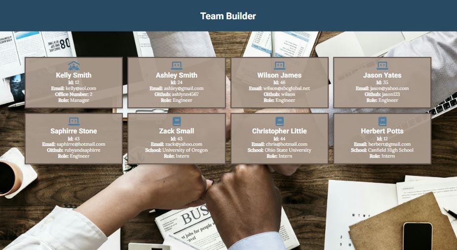

# Team Profile Generator

## Table-of-Contents

- [Description](#description)
- [Features](#usage-and-features)
- [Installation](#installation)
- [Technologies and Languages](#technologies-and-languages)
- [Future Development](#future-development)
- [Credits](#credits)

## Description

This is my tenth challenge assignment for the University of Oregon Coding Bootcamp 2022. The challenge is to create an application using Node.js that gathers information about employees to generate an HTML webpage displaying summaries for each person. There will also be basic code tests using the Jest framework.

## Features

This is how the generated HTML page will appear to users. It is responsive, adapting to multiple screen sizes using flexbox and media queries.

This application was developed using Test-Driven Development techniques though Jest. If the user wishes to see which tests pass, they can simply open the application within the proper directory and run the command `npm test`.

<iframe src="https://drive.google.com/file/d/1p-DQwGmyZ_-eo6VgUg_amYxE8siRHYn2/preview" width="640" height="480"></iframe>

In order to run this application, users must have all dependencies installed. See the installation section below for instructions. To start the application, use the command `node index.js`.

<iframe src="https://drive.google.com/file/d/1LkRx3okDZEFF-astKyuGU3Z3p7uU0ANv/preview" width="640" height="480"></iframe>

Follow the prompts given in the command line interface to give information about your team. Some prompts are required. Once completed, an HTML file will generate in `dist/index.html`. Open the HTML in a browser to view your team's webpage.

<iframe src="https://drive.google.com/file/d/1CY1jFAw5lcKqw_hKgHDbOuveSs10NqdB/preview" width="640" height="480"></iframe>

## Installation

In order to use this application, you will need to install it on your local computer.

1. Open the command line interface.
2. Clone the repository onto your local machine using the `git clone` command.
3. Once the repository has been cloned, navigate into the root directory of the application using the command `cd Team-Profile-Generator`.
4. Run the command `npm install` to install necessary packages and dependencies.
5. Once the dependencies have been properly installed, enter the command `node index.js` to initiate the application.
6. Navigate through the prompts in your command line interface using your keyboard.
7. Once completed, your webpage will generate automatically with the data you entered. Open `dist/index.html` to see your generated webpage.

In order to run the testing suites through Jest:

1. Complete steps 1-3 as listed above.
2. After all your dependencies are installed locally, run the command `npm test` to run all jest testing suites.

## Technologies and Languages

- [HTML](https://developer.mozilla.org/en-US/docs/Web/HTML)
- [CSS](https://developer.mozilla.org/en-US/docs/Web/CSS)
- [JavaScript](https://www.javascript.com/)
- [Node.js](https://nodejs.org/en/)
- [npm](https://www.npmjs.com/)
- [Jest](https://jestjs.io/)
- [Inquirer.js](https://www.npmjs.com/package/inquirer)

## Future Development

In the future, I would like to add the following improvements:

- Data permanence, so that you can load, edit, and delete your existing team data.
- An option to view your team data in tables within the command line interface before your team data is generated into a webpage.

I'm always interested in refactoring code to improve it's functionality. If you would like to suggest your own improvements, you can reach our development team at the links below.

- <a href="mailto:ashlynn4567@gmail.com">Email</a>
- <a href="https://github.com/ashlynn4567">GitHub</a>
- <a href="www.linkedin.com/in/Ashley-Lynn-Smith">LinkedIn</a>

## Credits

This project was built with the help of the University of Oregon's Coding Boot Camp.

Special thanks to [Mohamed Hassan](https://pixabay.com/photos/teamwork-cooperation-brainstorming-3213924/) for the background image used in this application.
